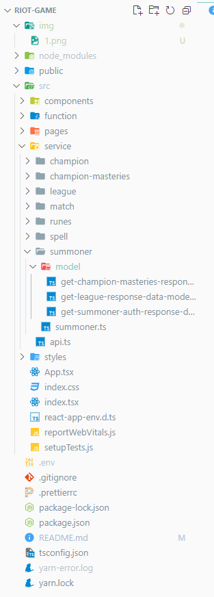
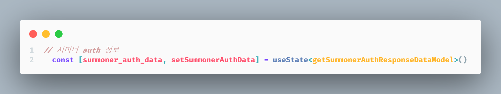
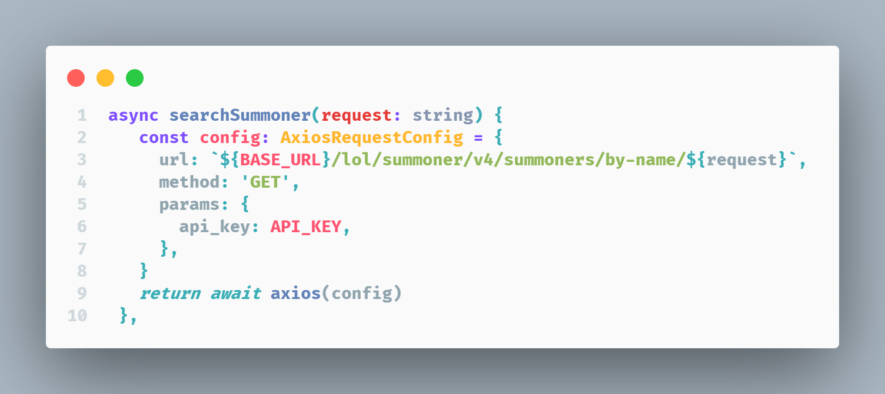
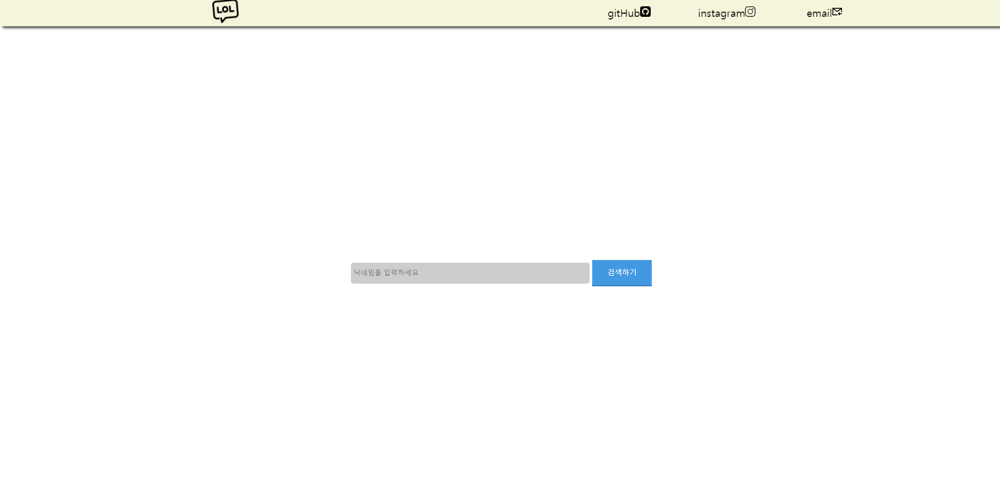
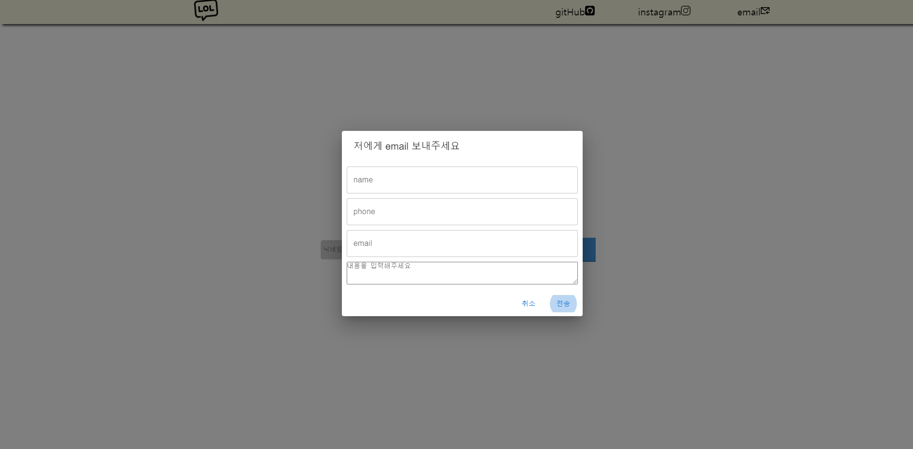
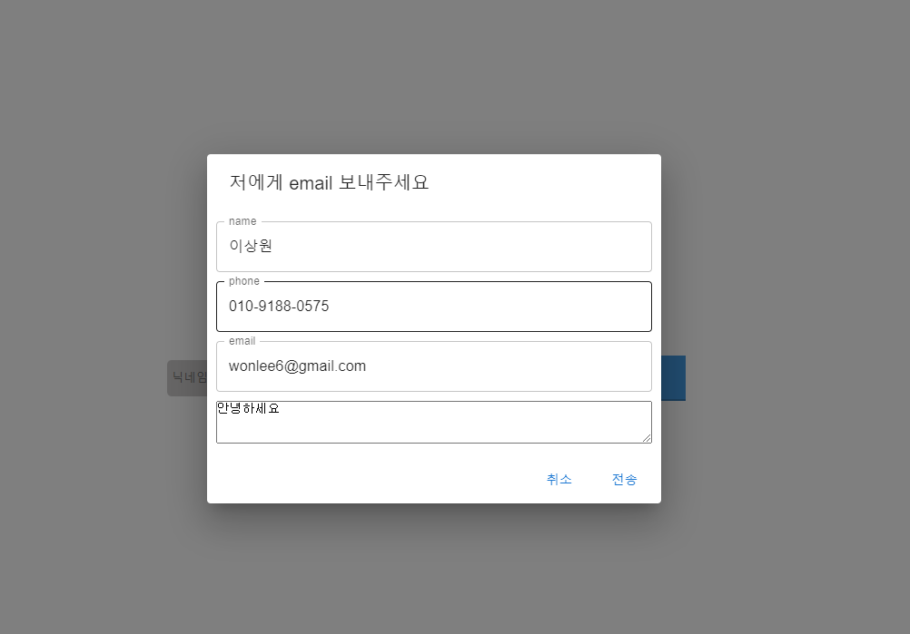
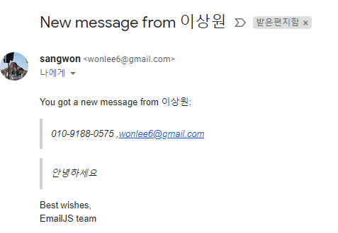
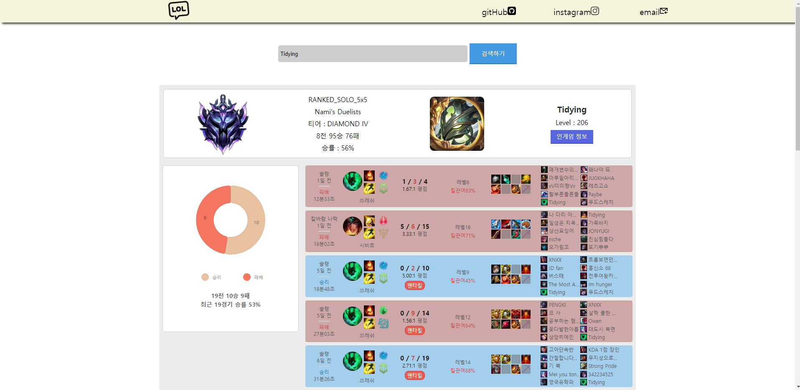

# Riot Game (LOL)

> Riot Games 의 league of legend API 이용하여 전적 검색 프로젝트

#### 현재 프로젝트 개발 중이며, 보완 또는 수정 작업 중입니다.

> 현재 20개 전적리스트만 검색 가능하며, 상위 리그(마스터 이상) 전적 검색은 불가능 합니다.  
> 검색 후 다른 아이디를 재검색 기능은 아직 불가능 합니다.  
> Riot API 정책 상 24시간 마다 app-key 값을 refresh 해야하므로 배포는 하지 않았습니다.

<!-- > 백엔드 java 추가 진행 중 입니다. -->

## 기술 스택

-  `v18`
- `Recoil`
-  `4.8.4`
-  `v6`
- `axios`
- `emailjs-com`
- 

## 화면 영상

<!-- ## 파일 구조

> service : API 요청에 따라 분류 -->

<!-- ### API flow

> [Riot API](https://developer.riotgames.com/apis) 공식 사이트 참조하여 작업 진행

state 생성(service -> \*API 명 -> model 안에 API 값 명시) -> API 요청 -> setState

 -->

<!-- ## 화면 예시 -->

<!-- ### main 화면

 -->

### EmailJS-com 라이브러리 사용

`emailjs-com` 라이브러리를 사용하여 이메일 전송 기능 구현  
(`material` 및 `nivo` 라이브러리 사용하여 css 작업 및 차트 구현)

<!--  -->
